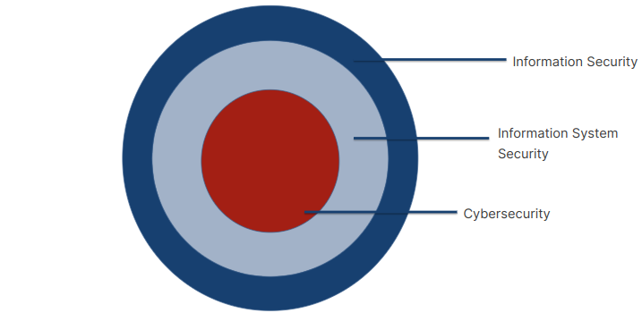

# What is Cybersecurity Important?
Por exemplo, pessoas que vivem em lugares afastados conseguem acessar médicos especializados utilizando computadores. Informações médicas podem ser coletadas localmente e enviadas para especialistas. Sem a segurança das redes esse envio estaria em perigo, devido ter informações sensíveis.

# Information securty (InfoSec) and Information Systems Security
<h3 style= "color: red">Information security </h3>
Prática de proteger informações. Abrange ferramentas e os processos utilizados para previnir, detectar e remediar ataques e ameaças a informações sensíveis. Também inclui a documentação dos processos. Essas informações podem estar em um computador, sobre uma mesa, qualquer lugar.

<h3 style= "color: red">Segurança de TI (IT Security)</h3>
Analisa todas as informações dentro de uma organização para categorizá-las e priorizar sua sensibilidade.
Poder ser classificadas como:

* não protegidas (necessário de controles)
* protegidas (algum nível de controle e proteção é necessário)
* confidenciais, secretas e ultrasecretas (cada nível com proteção e controle mais _confidential, secret, top secret_ rigorosos)

<h3 style= 'color:red'>Information Systems Security </h3>
Uma parte da InfoSec.
Proteção de sistemas de informação contra acesso não autorizado, modificação, destruição ou negação de acesso a usuários autorizados.

