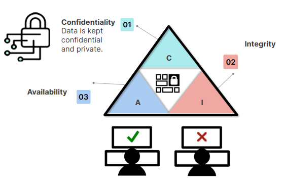

# What are the principles of Information security?

Os três princípios são: confidencialidade, integridade e disponibilidade .
_confidentiality, integrity and availability  C - I - A_

* Confidencialide: informações privadas devem permanecer confidenciais. Apenas pessoas autorizadas podem ler as mensagens.
* Integridade: dados devem ser protegidos de alterações de pessoas não autorizadas, caso sejam alterados é necessário avisar ao destinatário que essa mensagem foi alterada.
* Disponibilidade: pessoas autorizadas devem acesso as informações. Evitar que terceiros não autorizados esgotem os dados fazendo com que os dados fiquem indisponíveis para pessoas autorizadas.

A segurança da informação (_InfoSec - Information Security_) trabalha para que essa tríade seja seguida.

Tríade que vai contra a CIA - DAD:

* __Divulgação (Disclosure)__: expõe dados confidenciais.
* __Alteração (Alteration)__: alteração dos dados, tornando-os não confiáveis.
* __Negação (Denial)__: não permitir o acesso aos dados de pessoas autorizadas.

_Uma segurança como o Firewall poderá ajudar a neutralizar a tríade DAD_

# Authentication, Authorization and Accounting (Autenticação, autorização e contabilização)

Esses três conceitos constituem um framework de segurança que controla recursos, aplica políticas e audita o uso. Esse framwork desempenha um papel fundamental na gestão de redes e na cibersegurança, ao monitorar usuários e rastrear suas atividades.

## Autenticação
Processo de identificar uma pessoa ou coisa. Como uma ferramenta de gerenciamento de identidade e acesso (__IAM - Identity and access management__). O servidor AAA compara as credenciais de um usuário com sua base de dados.

## Autorização
Processo de controlar acesso a recursos. Um usuário pode ter privilégios para acessar alguns recursos do sistema. O administrador pode alterar os privilégios de um usuário.

## Contabilização
Registro  e rastreamento das atividades de agentes em dispositivos e redes de computadores. Monitora informações como:  tempo que o usuário esteve logado, dados que enviou ou recebeu, endereço de protocolo (IP), identificador uniforme de recurso (__URI - Uniform resource identifier__) e diferentes serviços acessados.