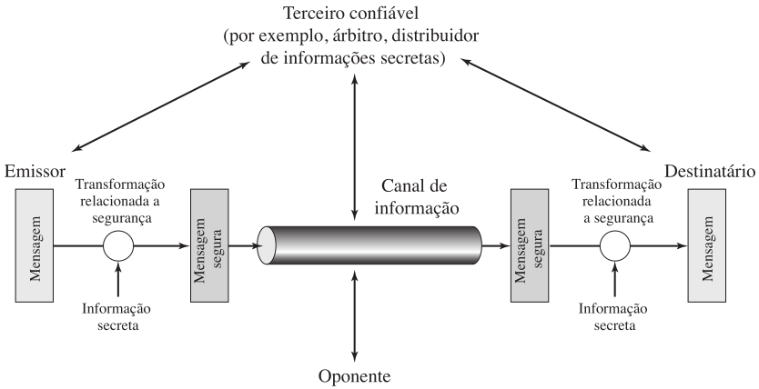
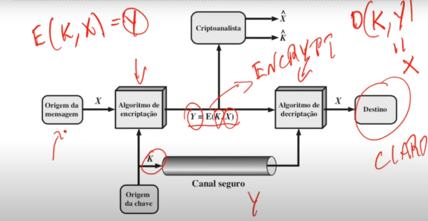

# Aula 02 - Princípios de Criptografia 

## Objetivo da aula: 

Entender o motivo de criptografia ser importante, sua definição, alguns termos, como: cifrar, decifrar, etc... Passar uma visão geral do processo de criptografia, caracterizar os processos criptográficos, além de uma breve história da criptografia. 

## Tópicos abordados: 

* Motivação 
* Definições 
* Exemplos 
* Breve histórico 
* Visão geral 
* Caracterização dos sistemas criptográficos 

## Explicação dos tópicos: 

### Motivação 

Atualmente temos comércios eletrônicos, onde possuímos clientes e servidores. Nestes servidores, há diversos arquivos sigilosos. Como estes dados trafegam sem que terceiros (Hackers) possam capturá-los? Isso pode ser resolvido com a criptografia. 

### Definições 

Definição 1: criptografia é a ciência responsável por manter trocas de mensagens seguras. 

Definição 2: É o ato de alterar uma mensagem para esconder a mensagem original. 

Definição 3: Um algoritmo de criptografia consiste em vários passos para cifrar e decifrar uma mensagem. 

__Cifrar:__ disfarçar a mensagem original (cleartext) 

__Decifrar:__ transformar a mensagem cifrada na mensagem original 

__Cleartext (texto claro):__ mensagem original sem modificações 

__Texto cifrado:__ mensagem codificada 

__Criptoanálise:__ estudo de técnicas para decifrar uma mensagem sem conhecer o processo para cifrá-la 

__Criptologia:__ reúne o conhecimento das áreas de criptografia e criptoanálise 

### Exemplos 

Cifra de césar: consiste em trocar cada letra na mensagem por uma letra três posições a frente. 	Exemplo: 

Texto claro: abc ->Texto cifrado: def 

A B C D E F G H ... 

Com o passar do tempo novos algoritmos foram criados devido encontrar falhas nos métodos. 

A área militar ajudou muito na evolução da criptografia. 

### Breve histórico 

__50 a.C.: Cifra de César__ - Criada por Júlio César, é um dos primeiros exemplos de criptografia. Utilizava substituições simples de letras para proteger mensagens militares. 

__1918: Máquina Enigma__ - Criada por Arthur Scherbius, usada amplamente pelos alemães durante a Segunda Guerra Mundial. Sua complexidade foi fundamental para a criptografia moderna, mas foi quebrada graças ao trabalho de Alan Turing e sua equipe. 

__1976: Criptografia de Chave Pública__ - Desenvolvida por Whitfield Diffie e Martin Hellman, revolucionou a área ao introduzir o conceito de chaves assimétricas. 

__1977: RSA__ - Algoritmo criado por Ron Rivest, Adi Shamir e Leonard Adleman, baseado na dificuldade de fatoração de números primos grandes. Tornou-se um dos sistemas mais utilizados para criptografia de chave pública. 

### Visão geral

   Criptografia e segurança de redes princípios e práticas - Edição 6.

  

1. Crie um algoritmo para realizar a transformação relacionada à segurança. O algoritmo deverá ser tal que um oponente não possa reverter sua finalidade. 

2. Gere a informação secreta a ser usada com o algoritmo. 

3. Desenvolva métodos para a distribuição e compartilhamento da informação secreta. 

4. Especifique um protocolo a ser usado pelos dois principais, que utilize o algoritmo de segurança e a informação secreta para estabelecer determinado serviço de segurança. 

   Imagem da videoaula. 

  

_Nota: o algoritmo de criptografia não deve depender apenas do sigilo dos passos do algoritmo. O sigilo deve estar na CHAVE do algoritmo, caso seja descoberta, basta apenas trocar essa chave._

A criptografia fornece: 

Confidencialidade : apenas pessoas autorizadas tem acesso aos dados. 

Integridade : dado é alterado apenas por pessoas autorizadas. 

Autenticidade: garante que quando X envia algo para Y, então Y sabe que foi X que enviou. 

Não-repúdio (rejeição): remetente e destinatário não podem negar que uma mensagem foi enviada. Algoritmos assimétricos garantem isso.																				 

__Caracterização dos sistemas criptográficos__

Tipos de operações que transformam texto claro em cifrado 

A maioria dos algoritmos usam: 

* Substituição (Cifra de César) 

* Transposição: elementos no texto claro são reordenados. 

__NENHUMA INFORMAÇÃO PODE SER PERDIDA.__ 

### Modo como o texto é processado

__Cifra de bloco:__ a mensagem é dividida em blocos, o tamanho desse bloco depende da implementação do algoritmo. Bom para ser implementado em software. 

__Cifra de fluxo:__ a mensagem é cifrada bit por bit, um de cada vez. Bom para ser implementado em hardware. 

### Número de chaves usadas 

__Criptografia simétrica:__ utilização de uma única chave. 

__Criptografia assimétrica:__ emissor e receptor usam chaves diferentes. Chave pública para cifrar e outra privada para decifrar. 

### Exemplos de aplicações 

* Sites de compras: protegidos pelo protocolo TLS (Transport Layer Security). Tem a ver com o HTTPS 

* Redes sem fio usam criptografia WPA1, WPA2, WEP... 

* Redes privadas virtuais (VPNs) usam TLS ou IP Security (IpSec). 

### Conclusão: 

Pode-se concluir que a criptografia é essencial com tantas informações sensíveis em servidores e que também é um processo complexo, pois é possível ser quebrado (note o tanto de sistemas criptográficos que já existiram). Algo essencial é que o algoritmo de criptografia não deve depender apenas do sigilo dos passos do algoritmo. O sigilo deve estar na chave do algoritmo, caso seja descoberta, basta apenas trocar. 